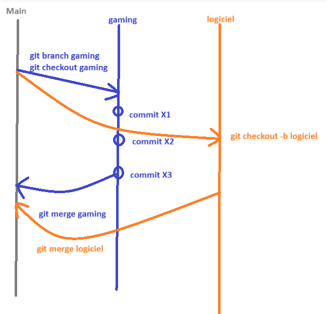

# [GIT](https://git-scm.com/)
## Avant de commencer :
* Voir la version git installée sur votre machine :
```
git version
```
* Pour configurer le nom de l'utilisateur de git sur votre machine :
```
git config --global user.name “Beurive Aude”
```
* Pour configurer l'email de l'utilisateur sur la machine
```
git config --global user.email “aude.beurive@bstorm.be”
```
* Initialise le dossier dans lequel la commande est effectuée comme étant un repository git 
```
git init
```
> [!NOTE] 
> Un dossier caché .git apparait alors dans votre dossier. C'est ce dossier qui contient toutes les informations de votre repository local (ex: le lien vers le repository distant, vos différents commit, etc)

## Commandes de base (local) :


* Permet de savoir quel est le statut de votre repository git
```
git status
```
> [!NOTE]
> Cette commande vous affichera les fichiers qui ne sont pas suivis (untracked), les fichiers suivis mais qui ne sont pas encore commit,...

* Permet d'ajouter les fichiers qui ont été modifiés/créés/supprimés dans la zone de staging
```
git add nomFichier
git add nomDossier
git add . 
```
> [!Note]
> git add . permet de directement ajouter au stating, tous les fichiers changed (modifiés, créés, supprimés)

* Permet de faire une version à l'instant T avec tous les fichiers actuellement dans la zone de staging
```
git commit -m "description de ce que vous commitez"
```
> [!Note]
> Vos messages de commit doivent être clairs, expliquer ce que vous faites (ajout d'une fonctionnalité, réglage d'un bug, etc) et on essaie au max de les faire en anglais

* Permet d'afficher un résumé de tous les commits
```
git log 
git log --graph (pour afficher un graphique avec les différentes banches)
git log --oneline (pour afficher les commits sur une seul ligne)
```

## Gitignore
Certains fichiers ne doivent jamais être suivis ni se retrouver dans les commits et sur le repository distant (ex: des fichiers de config, des variables d'environnement, etc). On ajoutera des règles dans un fichier .gitignore pour indiquer tous ces fichiers qu'on veut ignorer.

Ce fichier .gitignore doit lui, être indexé/staged puis commit et se retrouvera sur le repo distant.

Dans certains types de projets, le .gitignore sera automatiquement créé.

## Commande bonus
Par défaut, un dossier qui est actuellement vide, ne sera pas track, ni ajouté dans le staging, ni commit et du coup, n'apparaitra pas non plus sur le repo distant. Si vous souhaitez pouvoir add+commit et envoyer un dossier vide à distance, vous pouvez ajouter un fichier .gitkeep. Ce fichier n'apparaitra pas mais permet d'ajouter le dossier au tracking.

## Repository distant
Il existe plusieurs plateformes en ligne pour héberger ces repositories distants. Les plus connues sont :
* [Github](https://github.com/) (celui qu'on vous conseille, le plus démocratisé)
* [Gitlab](https://gitlab.com/) (mon petit préféré)
* [Bitbucket](https://bitbucket.org/)


## Commandes distant :


### Première mise en ligne du projet
Après avoir créé un repository distant, vous devrez, pour mettre en ligne la première fois, votre projet, faire les lignes suivantes :
* Cette ligne sert à modifier votre branche principale en local pour être sûre qu'elle s'appelle main, comme la branche principale à distance
```
git branch -M main 
```
* Cette ligne permet d'ajouter dans la liste des remote (des liens vers les repository distants), un nouveau lien
```
git remote add origin https://github.com/AudeBstorm/TF_Architecte_DemoGit.git
```
* Cette ligne permet d'envoyer nos commit actuels vers le repository distant
```
git push -u(f) origin main
git push -upstream origin main
git push -upstream -force origin main
```
> [!Note]
> L'option -u sert à indiquer qu'on met le focus sur la branche main de notre origin (notre repo distant) permettant pour les prochains envois d'écrire seulement git push\
L'option -f sert à forcer le push et écraser tout contenu existant sur la branche. (attention, à utiliser que si nécessaire). Sur Gitlab, il vous est proposé dans les commandes initiales parce qu'il faut écraser le ReadMe déjà présent.

### Partir d'un projet déjà existant à distance
```
git clone LIENVERSPROJET
```
Cette commande vous créé un repository local déjà tout paramétré avec le lien remote qui est fait. Il n'y a plus qu'à travailler de votre côté.

### Récupérer du travail qu'une autre personne a fait
```
git fetch
```
Cette ligne permettra de savoir si la branche du repository distant a été modifiée par rapport à la version que vous avons sur notre branche.
```
git pull
```
Cette ligne permettra de récupérer l'état actuel de la branche distante en local sur votre machine (⚠️ parfois il faudra gérer quelques conflits)

## Collaborer sur un projet
La majorité du temps, on ne travaille pas directement sur la branche main (qui d'ailleurs sera bloquée sur Gitlab), on va créer des branches\
Vous devrez vous adapter au cadre de travail mais souvent on conseille main>Dev>Features

 

### Créer une branche
Créer une branche
```
git branch nom_branche
```

Se déplacer sur une branche
```
git checkout nom_branche
git checkout numero_commit
```

Créer la branche puis se déplacer dessus 
```
git checkout -b nom_branche
```

> [!Note]
> Quand vous allez faire votre premier push, il faudra de nouveau pour mettre en upstream dessus
> ```
> git push -u origin nom_branche
>```
> Si la branche n'existe pas à distance, pas de panique, elle va être créée automatiquement.

### Fusionner deux branches
Pour fusionner deux branches, il faudra se placer sur la branche qui va recevoir
```
git checkout branche_parente(main)
```
Et effectuer un merge de la branche désirée
```
git merge branche_enfant(gaming)
```

> [!Warning]
> Attention, si un des fichiers que vous allez merge entre en conflit avec une fichier de la branche sur laquelle vous êtes, un conflit va se créer. Impossible de merge tant que le conflit n'est pas réglé. Vous allez donc devoir choisir le code que vous voulez conserver.\
> Dans vos logiciel d'édition de code (VSC, VS, Rider, WebStorm) vous aurez une fenêtre spéciale qui vous proposera les deux morceaux de code en conflit. Vous pourrez choisir de conserver le current (brancheParente qui va accueillir le merge), le incoming (brancheEnfant que vous souhaitez merge) ou de conserver les deux.


## Divers :
* **[Ctrl] + [J]** -> Ouvre le terminal de Visual Studio Code